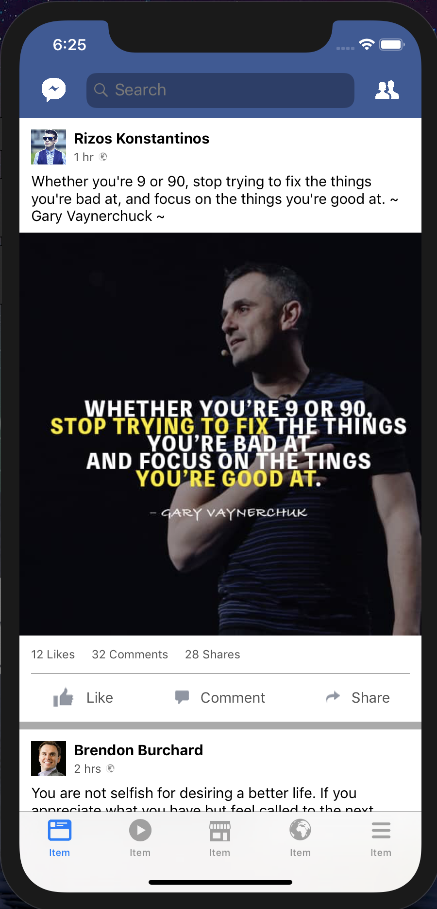

# Facebook

### Facebook Newsfeed

###### I developed a Facebook Newsfeed using `UItableView` and `UITableViewController` in iOS with Swift.

### App Stracture:

+ Create `UITableViewController` and `UITableView`.
+ Subclass `UITableViewCell` to create custom Table View Cell.
+ Apply Auto Layout on `UITableViewCell` to have dynamic Table View Cell Height.
---

+ The Newsfeed

---

+ The App

---

Tutorial Source: [David Tran](https://www.youtube.com/watch?v=E4ewmbIa_8c)
